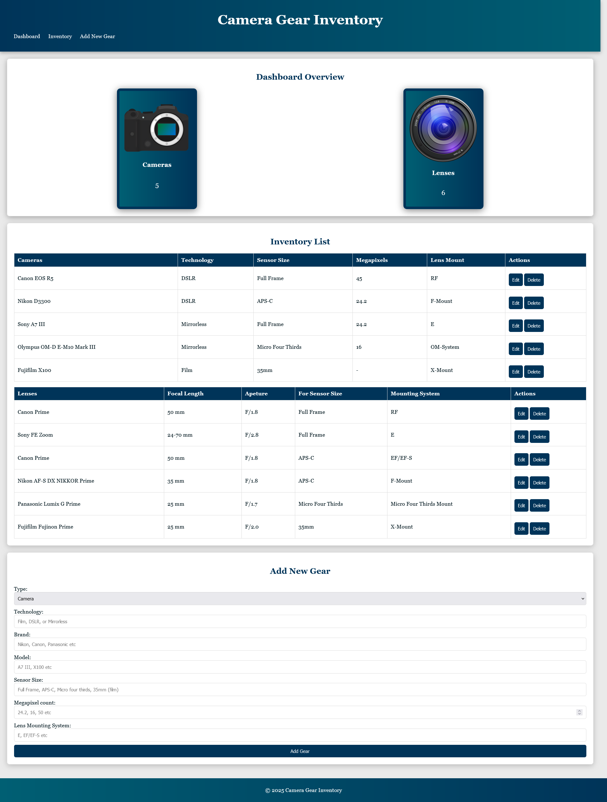

# **Camera Gear Inventory**

This is my first JavaScript-based project.

It is a simple website for testing purposes where users can save their camera bodies and lenses. I utilized JavaScript's capability to save data to the browser's local storage, eliminating the need for a backend with a database.

Any comments or code critiques, as well as improvement tips, are very welcome, as I am a beginner developer trying to learn.

You can check out a live demo of the Project here => [https://mattvrd.github.io/Camera_gear_inventory/](https://mattvrd.github.io/Camera_gear_inventory/)

